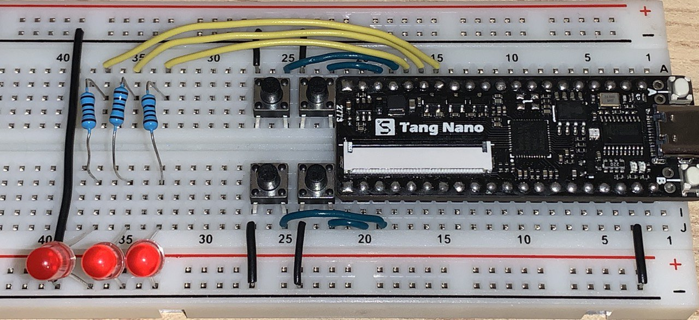

# Tang Nano Example

Repository: <https://github.com/E4tHam/tangnano_example>

---

## About

The Tang Nano is the famous / infamous $5 FPGA ([learn more here](https://tangnano.sipeed.com/en/)). This repository is a simple example of how to get started with the Tang Nano with [FuseSoC](https://github.com/olofk/fusesoc).

The RTL implements an adder. 

## Usage

```bash
make tangnano   # generate the bitstream
make load       # load the bitstream to the Tang Nano SRAM

make lint       # verify code meets Verilator standards
make sim        # simulate in icarus
make view       # open dump in gtkwave

make clean      # remove build files
```

## Requirements

* [FuseSoC](https://github.com/olofk/fusesoc)
* [Icarus Verilog](https://iverilog.fandom.com/wiki/Main_Page)
* [GTKWave](http://gtkwave.sourceforge.net/)
* [Verilator](https://www.veripool.org/verilator/)
* [Apicula](https://github.com/YosysHQ/apicula)
* [yosys](https://github.com/yosyshq/yosys)
* [nextpnr-gowin](https://github.com/YosysHQ/nextpnr#nextpnr-gowin)
* [openFPGALoader](https://github.com/trabucayre/openFPGALoader)

## Programming Flash

As of (2/22/22) programming the flash has difficulties. This is a collection of problems I encountered and their solutions. Hopefully in the future these will be resolved. :)

* Currently, [openFPGALoader](https://github.com/trabucayre/openFPGALoader) does not support writing to internal flash via the USB port. An external JTAG probe is required. [trabucayre/openFPGALoader#32](https://github.com/trabucayre/openFPGALoader/issues/32) To write to the flash, you must use [Gowin's proprietary programmer](https://dl.sipeed.com/TANG/Nano/IDE).
* There is a bug in the [official release](http://www.gowinsemi.com.cn/faq.aspx) of Gowin's FPGA programmer. You will need this version or higher: [Gowin Programmer 2](https://dl.sipeed.com/TANG/Nano/IDE).
* By default, Gowin's programmer has a programming frequency set to 30MHz, but the Tang Nano only supports up to 25MHz. Change the cable settings and set it lower; 2.5MHz is common.
